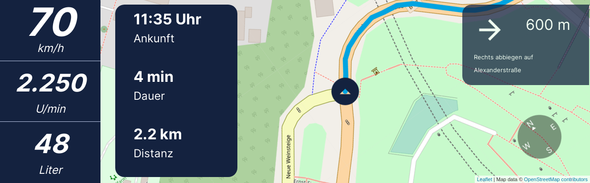
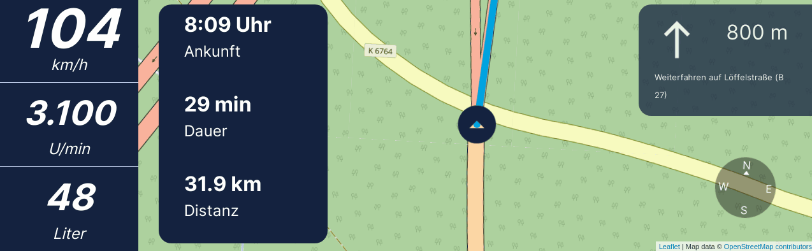
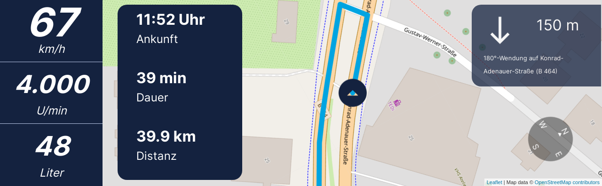

# About

<<!---->


University project about creating a navigation system for an automotive driving simulator on Automotive Grade Linux (AGL) operating system. 
The navigation system software consists of multiple parts, namely:


- [Persistent information panel of the Instrument Cluster](https://github.com/FabianGermany/Homescreen-Instrument-Cluster) (left part of the Instrument Cluster, also called homescreen)
- [Navigation Screen of the Instrument Cluster](https://github.com/FabianGermany/Navigation-System-Instrument-Cluster) (right part of the Instrument Cluster)
- [Navigation Screen of the Central Console](https://github.com/philipnglr/agl-html5-navigation) (not part of the screenshots below)
- [Routing algorithm](https://github.com/SebEckl/agl-service-routing.git)
- [LED panel for visualization of navigation instructions](https://github.com/mueller-kai/Arduino_LedCode-for-Driving-Simulator)

This repository is about the right part of the Instrument Cluster.

<!---->


The mockup-files created with Figma software can be seen in the mockup folder of this project.


# Install and run app

Providing node.js/npm is installed, this is how to run this software part (repository) in a browser:
```
npm install
npm run build
npm start
```
Then type 
```http://localhost:9002/ ```
in a browser such as Firefox Developer Edition.

If node.js/npm is not installed, make sure to install a suitable node version such as v12.18.4. Very recent versions may not compatible with the remaining software!

However, it's recommended to run the software in a AGL virtual machine. This process is more complex. For that you will need - apart from the AGL virtual machine - another Linux virtual machine to download the data and generate the wgt-file. With some commands using SSH/SCP you can transfer the wgt-file from the Linux machine to the AGL virtual machine. Finally, you can install this wgt-file on AGL and reboot the machine. 

For more information, see our documentation which is not published here on GitHub. If you need the documentation, feel free to get in touch with us.


# License
For License information please also see the license file and the other license files inside the used packages (e.g. inside leaflet-routing-machine folder etc.). We also attribute [OpenStreetMap](https://www.openstreetmap.org/copyright/en).

