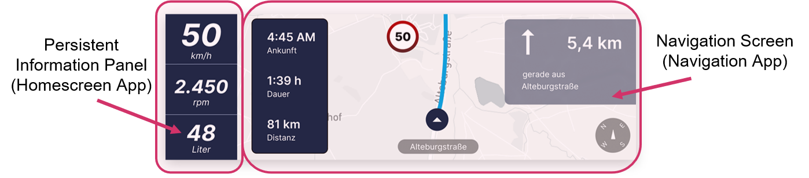

# Navigation system on Automotive Grade Linux (AGL) operating system

<details open="open">
  <summary>Table of Contents</summary>
  <ol>
    <li>
      <a href="#about">About</a>
    </li>
    <li>
      <a href="#install-and-run-app">Install and run app</a>
      <ul>
        <li><a href="#prerequisites">Prerequisites</a></li>
        <li><a href="#preparations">Preparations</a></li>
        <li><a href="#launch-in-browser">Launch in browser</a></li>
        <li><a href="#launch-in-agl-virtual-machine">Launch in AGL virtual machine</a></li>
      </ul>
    </li>
    <li><a href="#license">License</a></li>
  </ol>
</details>


## About

<!---->


University project about creating a navigation system for an automotive driving simulator on [Automotive Grade Linux](https://www.automotivelinux.org/) (AGL) operating system. 
The navigation system software consists of multiple parts, namely:


- [Persistent information panel of the Instrument Cluster](https://github.com/FabianGermany/Homescreen-Instrument-Cluster) (left part of the Instrument Cluster, also called homescreen)
- [Navigation Screen of the Instrument Cluster](https://github.com/FabianGermany/Navigation-System-Instrument-Cluster) (right part of the Instrument Cluster)
- [Navigation Screen of the Central Console](https://github.com/philipnglr/agl-html5-navigation) (not part of the screenshots below)
- [Routing algorithm](https://github.com/SebEckl/agl-service-routing.git)
- [LED panel for visualization of navigation instructions](https://github.com/mueller-kai/Arduino_LedCode-for-Driving-Simulator)

This repository is about the right part of the Instrument Cluster.

<!---->


The mockup-files created with Figma software can be seen in the mockup folder of this project.


## Install and run app

This is how to run this software part (repository) in a browser and how to run it inside the AGL virtual machine.

### Prerequisites

For the following steps, you need node.js/npm. If node.js/npm is not installed, make sure to install a suitable node version such as v12.18.4. Very recent versions may not compatible with the remaining software.

This app can run in a browser since it's a HTML app. However, it's recommended to run the software in a AGL virtual machine. For that you need to create an AGL virtual machine using VirtualBox software and find a way to connect this machine to your own operating system. One way is SSH/SCP.


### Preparations

1\. Open a terminal or shell in your operation system
<!--Or in the Linux VM: ssh -p 2222 agl-devel@localhost-->
   
2\. Clone this repo:
   ```
   git clone https://github.com/FabianGermany/Navigation-System-Instrument-Cluster.git
   ```

3\. Change the directory:
   ```
   cd Navigation-System-Instrument-Cluster
   ```

4\. Install npm packages:
   ```
   npm install
   ```
5\. Build app and create .wgt-file:
   ```
   npm run build
   ```

### Launch in browser


6\. Launch the app:
   ```
   npm start
   ```
7\. Type 
```http://localhost:9002/ ```
in a browser such as Firefox Developer Edition. 
The app will run in the browser now.


### Launch in AGL virtual machine

8\. Change the directory in order to see the .wgt file:

   ```
   cd package
   ```


9\. Transfer the .wgt file to the AGL system. Depending on your operating system and on how your AGL virtual machine is connected to your current operation system, one way might be using SSH/SCP such as:

   ```
   scp -P 2223 navigationIC.wgt root@[IP-Address]:/tmp/
   ```
Instead of ```[IP-Address] ``` use your own IP address.
For more information, see our documentation which is not published here on GitHub. If you need the documentation, feel free to get in touch with us. 


9\. Open another terminal in your operating system

10\. Log into your AGL machine. Depending how your AGL virtual machine is connected to your current operating system, one way might be:
   ```
   ssh -p 2223 root@localhost
   ```

11\. Change directory:
   ```
   cd /tmp/
   ```


10\. Install .wgt file on AGL:
   ```
   afm-util install navigationIC.wgt
   ```
11\. Reboot AGL machine. It's recommended to reboot at least twice.
   ```
   reboot
   ```

Now the AGL machine will run with the new app/functionality.


## License
This app is based on an [AGL template](https://git.automotivelinux.org/apps/html5-dashboard/tree/src).
We use several libraries/packages such as
[Leaflet](https://leafletjs.com/) or rather [this Leaflet fork](https://github.com/ronikar/Leaflet) from the GitHub user "ronikar".
Also we use [Leaflet Routing Machine](https://www.liedman.net/leaflet-routing-machine/).
We also attribute [OpenStreetMap](https://www.openstreetmap.org/copyright/en) and its [map tiles](https://github.com/gravitystorm/openstreetmap-carto/).
For more license information please also see the license file and the other license files inside the used packages (e.g. inside leaflet-routing-machine folder etc.). 