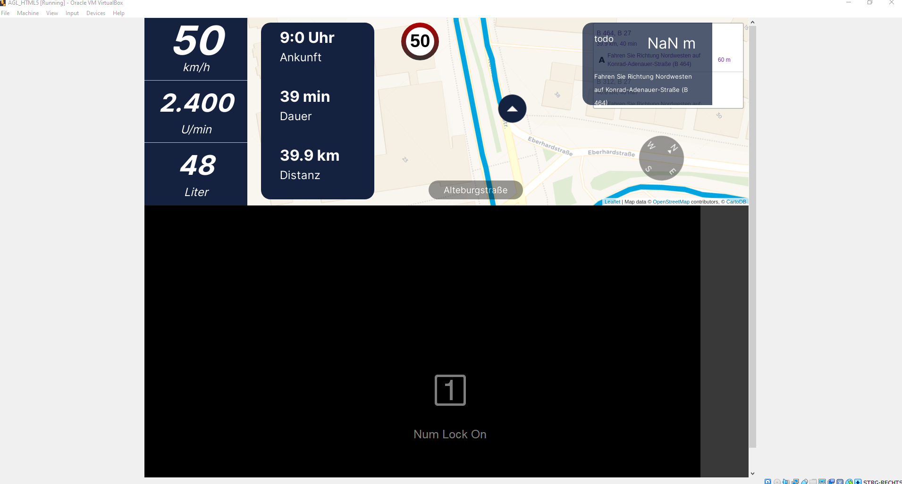

# About
University project about creating a navigation system for cars. 
The software consists of multiple parts, especially https://github.com/FabianGermany/Homescreen-Instrument-Cluster, https://github.com/FabianGermany/Navigation-System-Instrument-Cluster and https://github.com/philipnglr/agl-html5-navigation.

